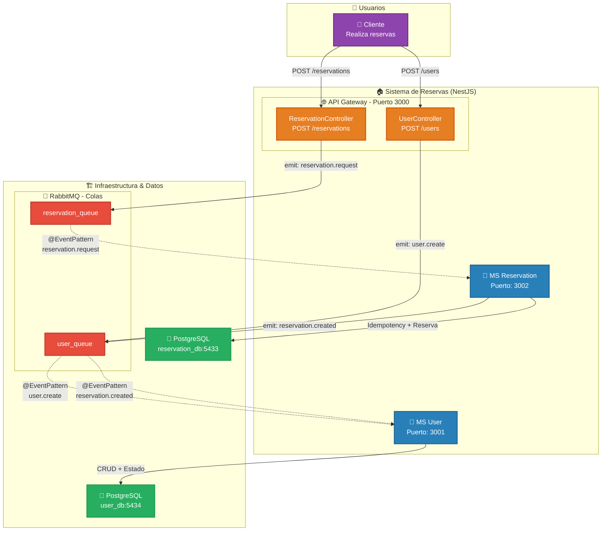

# Sistema de Reservas de Usuarios - Arquitectura de Microservicios

## Diagrama C4 - Nivel 1: Contexto del Sistema



## Descripción de Componentes

### 1. **API Gateway** (Puerto 3000)
- **Responsabilidad**: Punto de entrada HTTP para clientes externos
- **Tecnología**: NestJS con ClientProxy de RabbitMQ
- **Estructura Modular**:
  - `UserModule` → `UserController` → `POST /users`
  - `ReservationModule` → `ReservationController` → `POST /reservations`
- **Función**: Recibe solicitudes HTTP y las publica como eventos en RabbitMQ

### 2. **MS Reservation** (Puerto 3002)
- **Responsabilidad**: Gestión de reservas con garantía de idempotencia (Estrategia Avanzada: Idempotent Consumer)
- **Tecnología**: NestJS + TypeORM + PostgreSQL
- **Estructura**:
  - `reservation/` → Controlador, Servicio y Entidad de Reserva
  - `idempotency/` → Guard, Service y Entity para control de duplicados
- **Base de Datos**: PostgreSQL (reservation_db) en puerto 5433
- **Eventos**: 
  - Consume: `reservation.request` desde `reservation_queue`
  - Publica: `reservation.created` hacia `user_queue`

### 3. **MS User** (Puerto 3001)
- **Responsabilidad**: Gestión de usuarios
- **Tecnología**: NestJS + TypeORM
- **Estructura**:
  - `user/` → Consumer, Service y Entity
- **Funciones**:
  - Crear usuarios nuevos (con idempotencia por email)
  - Procesar notificaciones de reservas creadas
- **Base de Datos**: PostgreSQL (user_db) en puerto 5434
- **Eventos**: 
  - Consume: `user.create` desde `user_queue` (creación)
  - Consume: `reservation.created` desde `user_queue` (notificación)

### 4. **RabbitMQ** (Puertos 5672, 15672)
- **Responsabilidad**: Message broker para comunicación asíncrona
- **Colas**:
  - `reservation_queue`: Para eventos `reservation.request`
  - `user_queue`: Para eventos `user.create` y `reservation.created`
- **Características**: ACK manual, colas durables

### 5. **PostgreSQL**
- **reservation_db** (Puerto 5433): Almacena reservas + tabla de idempotencia
- **user_db** (Puerto 5434): Almacena información de usuarios

## Estrategia de Resiliencia: Idempotent Consumer (Opción B)

Se ha implementado el patrón **Idempotent Consumer** para garantizar la integridad de los datos ante posibles duplicados de mensajes en RabbitMQ.

- **En MS Reservation**: Se utiliza una tabla dedicada `idempotency` en PostgreSQL. Antes de procesar una solicitud de reserva (`reservation.request`), se verifica si el `message_id` ya existe. Si existe, se ignora el procesamiento. Si no, se procesa y se guarda el ID en la misma transacción.
- **En MS User**: Se utiliza idempotencia lógica basada en el campo único `email` para la creación de usuarios. Si llega un mensaje `user.create` con un email ya existente, se detecta y no se crea un duplicado.

## Flujos del Sistema

### Flujo 1: Crear Usuario
1. **Cliente** envía `POST /users` con `{name, email}` al **Gateway**
2. **Gateway** (UserController) genera UUID y publica `user.create` en `user_queue`
3. **MS User** consume el evento
4. Verifica idempotencia (email único)
5. Si es nuevo → crea usuario en PostgreSQL
6. ACK del mensaje

### Flujo 2: Crear Reserva
1. **Cliente** envía `POST /reservations` con `{user_id, resource_id}` al **Gateway**
2. **Gateway** (ReservationController) genera UUID y publica `reservation.request` en `reservation_queue`
3. **MS Reservation** consume el evento
4. **IdempotencyGuard** verifica si el message_id ya fue procesado
5. Si es nuevo:
   - Guarda message_id en tabla de idempotencia
   - Crea registro de reserva en PostgreSQL
   - Publica `reservation.created` hacia `user_queue`
6. **MS User** consume `reservation.created`
7. Procesa la notificación (log o actualización de estado)
8. ACK del mensaje

## Ejecución

```bash
# Levantar infraestructura
docker-compose up -d

# Instalar dependencias (en cada microservicio)
cd ms-gateway && npm install
cd ms-reservation && npm install
cd ms-user && npm install

# Ejecutar microservicios (cada uno en terminal separada)
cd ms-gateway && npm run start:dev    # Puerto 3000
cd ms-reservation && npm run start:dev   # Puerto 3002
cd ms-user && npm run start:dev     # Puerto 3001
```

## Pruebas

```bash
# Crear un usuario
curl -X POST http://localhost:3000/users \
  -H "Content-Type: application/json" \
  -d '{"name": "Juan Perez", "email": "juan@example.com"}'

# Crear una reserva
curl -X POST http://localhost:3000/reservations \
  -H "Content-Type: application/json" \
  -d '{"user_id": "<UUID_DEL_USUARIO>", "resource_id": "Sala-1"}'

# Ver usuarios (directo al microservicio, si tuviera endpoint GET expuesto, o verificar logs)
# Nota: MS User no expone HTTP GET en este ejemplo, verificar logs o DB.
```
